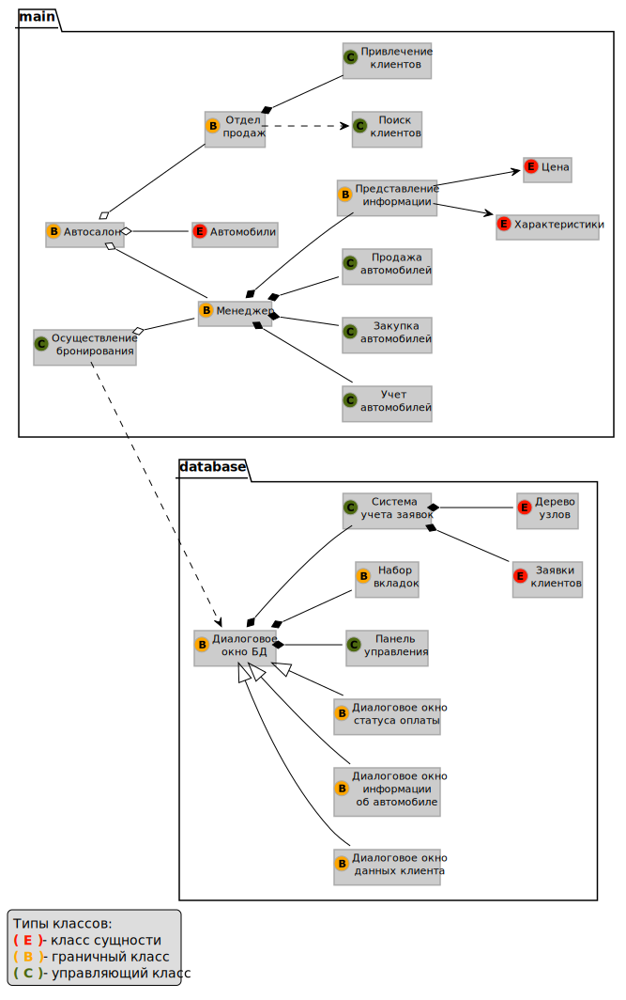
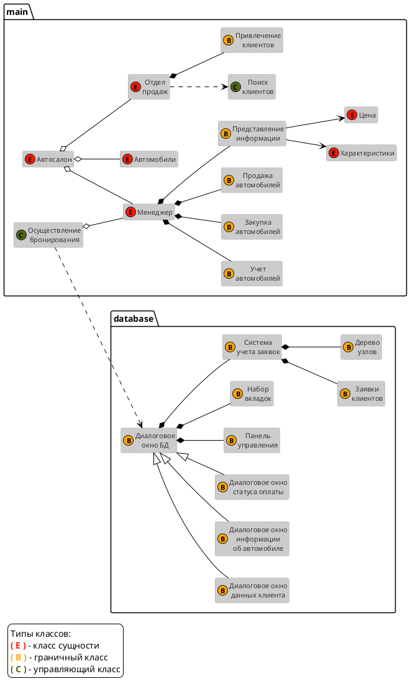

МИНИСТЕРСТВО НАУКИ И ВЫСШЕГО ОБРАЗОВАНИЯ РОССИЙСКОЙ ФЕДЕРАЦИИ 
Федеральное государственное бюджетное образовательное учреждение высшего образования 
<b>"МИРЭА - Российский технологический университет"</b>  
<b>РТУ МИРЭА</b>

---
Институт информационных технологий 
Кафедра практической и прикладной информатики

<b>ОТЧЕТ ПО ПРАКТИЧЕСКОЙ РАБОТЕ № 3</b>
  
<b>по дисциплине</b> 
«Анализ и концептуальное моделирование систем»
  

Выполнил студент группы ИКБО-02-20
&nbsp;&nbsp;&nbsp;&nbsp;&nbsp;&nbsp;&nbsp;&nbsp;&nbsp;&nbsp;&nbsp;&nbsp;
Антонов А.Д.

Принял cтарший преподаватель
&nbsp;&nbsp;&nbsp;&nbsp;&nbsp;&nbsp;&nbsp;&nbsp;&nbsp;&nbsp;&nbsp;&nbsp;&nbsp;&nbsp;&nbsp;&nbsp;&nbsp;&nbsp;&nbsp;&nbsp;&nbsp;&nbsp;
Ахмедова Х.Г.

 

Практическая работа выполнена
&nbsp;&nbsp;&nbsp;&nbsp;&nbsp;&nbsp;&nbsp;&nbsp;&nbsp;&nbsp;&nbsp;&nbsp;&nbsp;
«__» _______ 2022 г.

«Зачтено»
&nbsp;&nbsp;&nbsp;&nbsp;&nbsp;&nbsp;&nbsp;&nbsp;&nbsp;&nbsp;&nbsp;&nbsp;&nbsp;&nbsp;&nbsp;&nbsp;&nbsp;&nbsp;&nbsp;&nbsp;&nbsp;&nbsp;&nbsp;&nbsp;&nbsp;&nbsp;&nbsp;&nbsp;&nbsp;&nbsp;&nbsp;&nbsp;&nbsp;&nbsp;&nbsp;&nbsp;&nbsp;&nbsp;&nbsp;&nbsp;&nbsp;&nbsp;&nbsp;&nbsp;&nbsp;&nbsp;&nbsp;&nbsp;&nbsp;&nbsp;&nbsp;
«__» _______ 2022 г.

 Москва 2022

---

# Практическая работа №3.
**Построение UML – модели системы. Диаграмма классов анализа.**

Содержание:
- [Практическая работа №3.](#практическая-работа-3)
  - [Цели и задачи:](#цели-и-задачи)
  - [Ход работы:](#ход-работы)
  - [Вывод:](#вывод)
  - [Приложение:](#приложение)

## Цели и задачи:

**Цель работы:**
изучить структуру иерархии классов системы.

**Задачи:**
научиться выстраивать структуру основных элементов диаграммы классов анализа с определением видов классов и типов отношений.

**Вариант: 1**
– Моделирование организации продаж новых автомобилей в автосалоне.

## Ход работы:
Построить диаграмму классов анализа рассматриваемой системы с учетом индивидуального варианта (Рис. 1):

> Рис. 1 - Построенная диаграмма классов.

В верхней части диаграммы абстрактно выделены основные функции автосалона - учёт и продажа автомобилей, поиск и привлечение клиентов и т.д.
В нижней части диаграммы описана концептуальная система базы данных автосалона.

## Вывод:
В результате данной практической работы были изучены элементы структуры иерархии классов диаграммы UML. Было выполнено задание в соответствии с индивидуальным вариантом.

## Приложение:
Диаграмма и этот вариант отчета сгенерированы с помощью кода.
Для генерации диаграммы использовался язык PlantUML, из написанного кода создана диаграмма в формате svg.
Этот вариант отчета написан в формате Markdown и экспортирован в формат pdf.

Код диаграммы на языке PlantUML приведен ниже:

