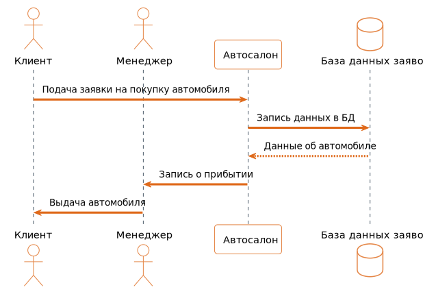

МИНИСТЕРСТВО НАУКИ И ВЫСШЕГО ОБРАЗОВАНИЯ РОССИЙСКОЙ ФЕДЕРАЦИИ 
Федеральное государственное бюджетное образовательное учреждение высшего образования 
<b>"МИРЭА - Российский технологический университет"</b>  
<b>РТУ МИРЭА</b>

---
Институт информационных технологий 
Кафедра практической и прикладной информатики

<b>ОТЧЕТ ПО ПРАКТИЧЕСКОЙ РАБОТЕ № 4</b>
  
<b>по дисциплине</b> 
«Анализ и концептуальное моделирование систем»
  

Выполнил студент группы ИКБО-02-20
&nbsp;&nbsp;&nbsp;&nbsp;&nbsp;&nbsp;&nbsp;&nbsp;&nbsp;&nbsp;&nbsp;&nbsp;
Антонов А.Д.

Принял cтарший преподаватель
&nbsp;&nbsp;&nbsp;&nbsp;&nbsp;&nbsp;&nbsp;&nbsp;&nbsp;&nbsp;&nbsp;&nbsp;&nbsp;&nbsp;&nbsp;&nbsp;&nbsp;&nbsp;&nbsp;&nbsp;&nbsp;&nbsp;
Ахмедова Х.Г.

 

Практическая работа выполнена
&nbsp;&nbsp;&nbsp;&nbsp;&nbsp;&nbsp;&nbsp;&nbsp;&nbsp;&nbsp;&nbsp;&nbsp;&nbsp;
«__» _______ 2022 г.

«Зачтено»
&nbsp;&nbsp;&nbsp;&nbsp;&nbsp;&nbsp;&nbsp;&nbsp;&nbsp;&nbsp;&nbsp;&nbsp;&nbsp;&nbsp;&nbsp;&nbsp;&nbsp;&nbsp;&nbsp;&nbsp;&nbsp;&nbsp;&nbsp;&nbsp;&nbsp;&nbsp;&nbsp;&nbsp;&nbsp;&nbsp;&nbsp;&nbsp;&nbsp;&nbsp;&nbsp;&nbsp;&nbsp;&nbsp;&nbsp;&nbsp;&nbsp;&nbsp;&nbsp;&nbsp;&nbsp;&nbsp;&nbsp;&nbsp;&nbsp;&nbsp;&nbsp;
«__» _______ 2022 г.

 Москва 2022

---

# Практическая работа №4.
**Построение UML – модели системы. Диаграмма последовательности.**

Содержание:
- [Практическая работа №4.](#практическая-работа-4)
  - [Цели и задачи](#цели-и-задачи)
  - [Ход работы](#ход-работы)
    - [1. Приведенный вариант: диаграмма последовательности](#1-приведенный-вариант-диаграмма-последовательности)
    - [2. Приведенный вариант: диаграмма кооперации](#2-приведенный-вариант-диаграмма-кооперации)
    - [3. Свой вариант: диаграмма последовательности](#3-свой-вариант-диаграмма-последовательности)
    - [4. Свой вариант: диаграмма кооперации](#4-свой-вариант-диаграмма-кооперации)
  - [Вывод](#вывод)
  - [Приложение](#приложение)

## Цели и задачи

**Цель работы:**
изучить структуру модели анализа, правила построения диаграмм последовательности, кооперации.

**Задачи:**
научиться отображать взаимодействие объектов в динамике.

**Вариант: 1**
– Моделирование организации продаж новых автомобилей в автосалоне.

## Ход работы
### 1. Приведенный вариант: диаграмма последовательности
Построить диаграмму последовательности по описанию приведенного варианта использования:
> Студент хочет записаться на некий семинар, предлагаемый в рамках некоторого учебного курса. С этой целью проводится проверка подготовленности студента, для чего запрашивается список (история) семинаров курса, уже пройденных студентом (перейти к следующему семинару можно, лишь проработав материал предыдущих занятий). После получения истории семинаров объект класса "Слушатель" получает статус подготовленности, на основе которой студенту сообщается результат (статус) его попытки записи на семинар.

Заполнить таблицу на основе полученной диаграммы.

> Рис. 1 - Диаграмма последовательности при запросе доступа к семинару

 

> Таблица 1 - Взаимодействие элементов диаграммы:

| Отправитель | Тип сообщения | Наименование                       | Получатель |
| ----------- | ------------- | ---------------------------------- | ---------- |
| Студент     | Синхронное    | Запрос на запись на семинар        | Слушатель  |
| Слушатель   | Синхронное    | Запрос списка пройденных семинаров | Курс       |
| Курс        | Возврат       | Выдача списка пройденных семинаров | Слушатель  |
| Слушатель   | Самовызов     | Проверка статуса подготовленности  | Слушатель  |
| Слушатель   | Возврат       | Выдача результата записи           | Студент    |

### 2. Приведенный вариант: диаграмма кооперации
Построить диаграмму кооперации по описанию варианта использования в п.1.

> Рис. 2 - Диаграмма кооперации при запросе доступа к семинару

### 3. Свой вариант: диаграмма последовательности
Построить модель отношений между объектами (диаграмма последовательности) рассматриваемой системы (варианта учебного проекта) в рамках одного прецедента.

> Рис. 3 - Диаграмма последовательности при заказе автомобиля

### 4. Свой вариант: диаграмма кооперации
Построить модель отношений между объектами (диаграмма кооперации) рассматриваемой системы (варианта учебного проекта) в рамках одного прецедента.

> Рис. 4 - Диаграмма кооперации при заказе автомобиля

## Вывод
В ходе данной работы были изучены структуры модели анализа и правила построения диаграмм последовательности и кооперации. Также было выполнено задание в соответствии с индивидуальным вариантом.

## Приложение
Диаграммы последовательности в этой работе сгенерированы с помощью кода.
Для генерации диаграмм использовался язык **PlantUML**, из написанного кода создана диаграмма в формате `.svg`.
Диаграммы кооперации сделаны с помощью онлайн-инструмента **draw.io**.
Отчет написан в формате **Markdown** (`.md`) и экспортирован в формат `.pdf`.

Код диаграмм приведен ниже:
> Листинг 1 - Код диаграммы последовательности для приведенного варианта

 

> Листинг 2 - Код диаграммы последовательности для индивидуального варианта

