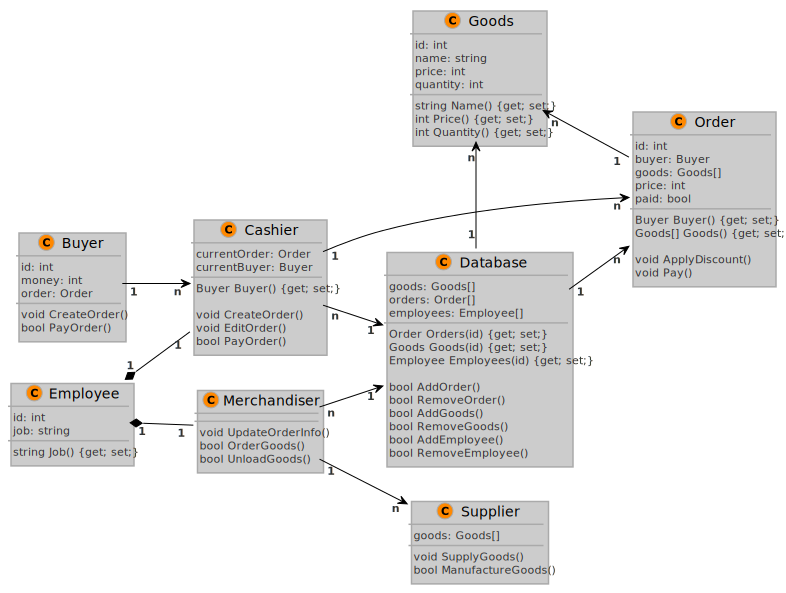
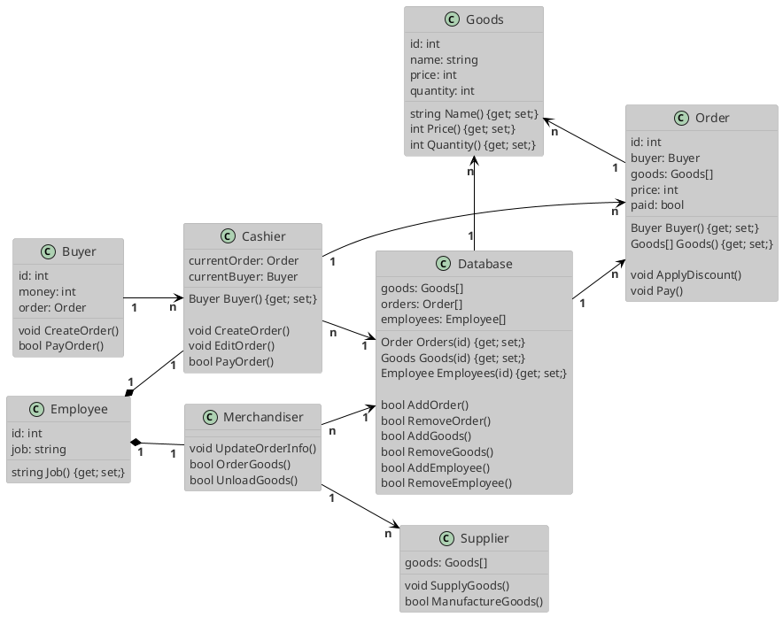

МИНИСТЕРСТВО НАУКИ И ВЫСШЕГО ОБРАЗОВАНИЯ РОССИЙСКОЙ ФЕДЕРАЦИИ 
Федеральное государственное бюджетное образовательное учреждение высшего образования 
<b>"МИРЭА - Российский технологический университет"</b>  
<b>РТУ МИРЭА</b>

---
Институт информационных технологий 
Кафедра практической и прикладной информатики

<b>ОТЧЕТ ПО ПРАКТИЧЕСКОЙ РАБОТЕ № 5</b>
  
<b>по дисциплине</b> 
«Анализ и концептуальное моделирование систем»
  

Выполнил студент группы ИКБО-02-20
&nbsp;&nbsp;&nbsp;&nbsp;&nbsp;&nbsp;&nbsp;&nbsp;&nbsp;&nbsp;&nbsp;&nbsp;
Антонов А.Д.

Принял cтарший преподаватель
&nbsp;&nbsp;&nbsp;&nbsp;&nbsp;&nbsp;&nbsp;&nbsp;&nbsp;&nbsp;&nbsp;&nbsp;&nbsp;&nbsp;&nbsp;&nbsp;&nbsp;&nbsp;&nbsp;&nbsp;&nbsp;&nbsp;
Ахмедова Х.Г.

 

Практическая работа выполнена
&nbsp;&nbsp;&nbsp;&nbsp;&nbsp;&nbsp;&nbsp;&nbsp;&nbsp;&nbsp;&nbsp;&nbsp;&nbsp;
«__» _______ 2022 г.

«Зачтено»
&nbsp;&nbsp;&nbsp;&nbsp;&nbsp;&nbsp;&nbsp;&nbsp;&nbsp;&nbsp;&nbsp;&nbsp;&nbsp;&nbsp;&nbsp;&nbsp;&nbsp;&nbsp;&nbsp;&nbsp;&nbsp;&nbsp;&nbsp;&nbsp;&nbsp;&nbsp;&nbsp;&nbsp;&nbsp;&nbsp;&nbsp;&nbsp;&nbsp;&nbsp;&nbsp;&nbsp;&nbsp;&nbsp;&nbsp;&nbsp;&nbsp;&nbsp;&nbsp;&nbsp;&nbsp;&nbsp;&nbsp;&nbsp;&nbsp;&nbsp;&nbsp;
«__» _______ 2022 г.

 Москва 2022

---

# Практическая работа №5.
**Построение UML – модели системы. Диаграмма классов.**

## Цели и задачи

**Цель работы:**
изучить структуру модели проектирования, правила построения диаграммы классов.

**Задачи:**
описать сервисные функции исследуемой системы.

**Вариант: 1**
– Моделирование организации розничного бизнеса.

## Ход работы
### 1. Диаграмма классов
Построим диаграмму классов розничного предприятия:

> Рис. 1 - Диаграмма классов розничного предприятия

### 2. Таблицы
Заполним таблицы 1, 2 на основе полученной диаграммы в п.1:

> Таблица 1 - Описание классов диаграммы

| Название класса                | Описание                                                                                                                           |
| ------------------------------ | ---------------------------------------------------------------------------------------------------------------------------------- |
| Сотрудник (Employee)        | Базовый класс, описывающий идентификатор и вакансию сотрудника, позволяет менять и получать вакансию                               |
| Покупатель (Buyer)          | Класс, описывающий идентификатор, количество денег и заказ покупателя, позволяет создавать и оплачивать заказ                      |
| Товар (Goods)               | Класс, описывающий идентификатор, название, цену и количество на складе у товара, позволяет менять и получать свои поля            |
| Заказ (Order)               | Класс, описывающий идентификатор, покупателя, цену, массив товаров и статус оплаты у заказа, позволяет менять и получать свои поля |
| База данных (Database)      | Класс, описывающий массивы товаров, заказов и сотрудников в предприятии, позволяет менять и получать свои поля                     |
| Поставщик (Supplier)        | Класс, описывающий массив имеющихся товаров, позволяет поставлять товары и создавать новые                                         |
| Кассир (Cashier)            | Класс, описывающий текущий заказ и текущего покупателя у кассира, позволяет управлять заказом                                      |
| Мерчандайзер (Merchandiser) | Класс, позволяющий редактировать товары через базу данных, а также заказывать и получать поставку                                  |

 

> Таблица 2 - Взаимодействие между классами

| Класс        | Кратность | Тип отношения      | Класс        |
| ------------ | --------- | ------------------ | ------------ |
| Сотрудник    | 1..1      | Обобщение          | Кассир       |
| Сотрудник    | 1..1      | Обобщение          | Мерчандайзер |
| Покупатель   | 1..n      | Простая ассоциация | Кассир       |
| Мерчандайзер | 1..n      | Простая ассоциация | Поставщик    |
| Мерчандайзер | n..1      | Простая ассоциация | База данных  |
| Кассир       | n..1      | Простая ассоциация | База данных  |
| Кассир       | 1..n      | Простая ассоциация | Заказ        |
| Заказ        | 1..n      | Простая ассоциация | Товар        |
| База данных  | 1..n      | Простая ассоциация | Товар        |
| База данных  | 1..n      | Простая ассоциация | Заказ        |

## Вывод
В результате выполнения данной практической работы были изучены структура модели проектирования и правила построения диаграммы классов.

## Приложение
Диаграммы последовательности в этой работе сгенерированы с помощью кода.
Для генерации диаграммы использовался язык **PlantUML**, из написанного кода создана диаграмма в формате `.svg`.
Отчет написан в формате **Markdown** (`.md`) и экспортирован в формат `.pdf`.

Код диаграмм приведен ниже:
> Листинг 1 - Код диаграммы последовательности для приведенного варианта

