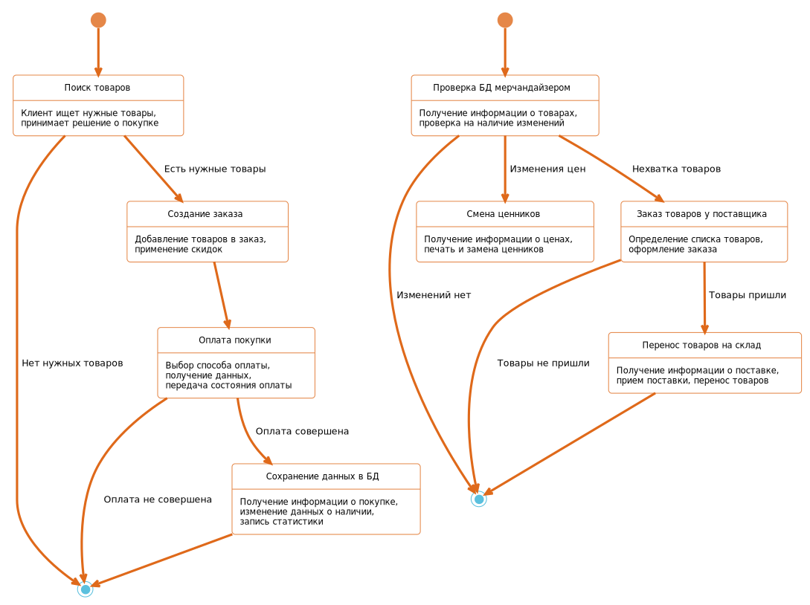
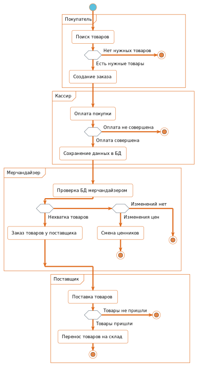
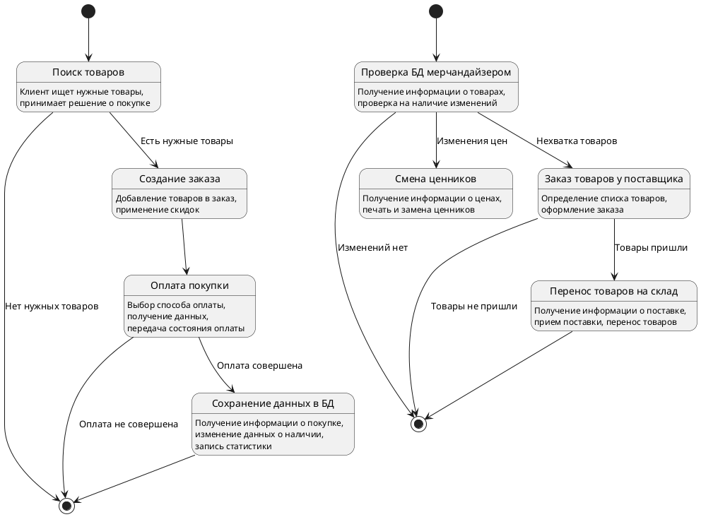
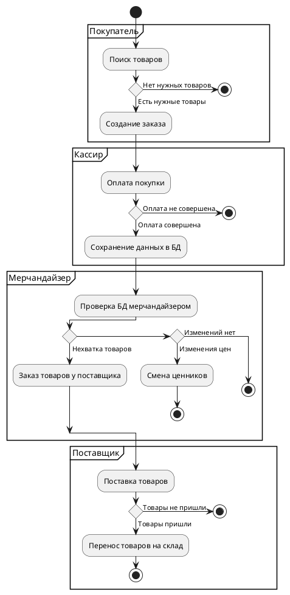

# Практическая работа №6.
**Построение UML – модели системы. Диаграмма деятельности.**

## Цели и задачи

**Цель работы:**
научиться строить усовершенствованные блок-схемы с параллельными процессами.

**Задачи:**
описать все системные операции и последовательность состояний и переходов в рассматриваемой системе.

**Вариант: 1**
– Моделирование организации розничного бизнеса.

## Ход работы
1. Описание возможных последовательностей состояний и переходов, которые характеризуют поведение элемента розничного торгового предприятия с помощью диаграммы состояний.

> Рис. 1 - Диаграмма состояния

2. Описать все системные операции посредством диаграммы деятельности.

> Рис. 2 - Диаграмма деятельности

## Вывод
В результате выполнения данной практической работы были изучены усовершенствованные блок-схемы с параллельными процессами.

## Приложение
Диаграммы последовательности в этой работе сгенерированы с помощью кода.
Для генерации диаграммы использовался язык **PlantUML**, из написанного кода создана диаграмма в формате `.svg`.
Отчет написан в формате **Markdown** (`.md`) и экспортирован в формат `.pdf`.

Код диаграмм приведен ниже:
> Листинг 1 - Код диаграммы состояний

 

> Листинг 2 - Код диаграммы деятельности

