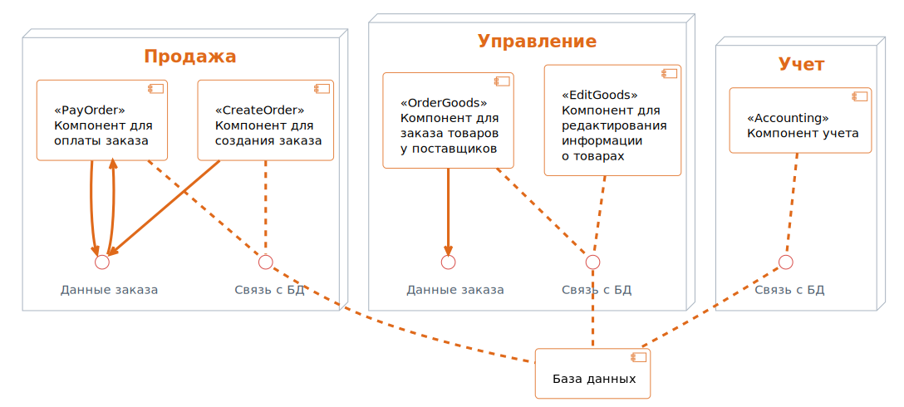
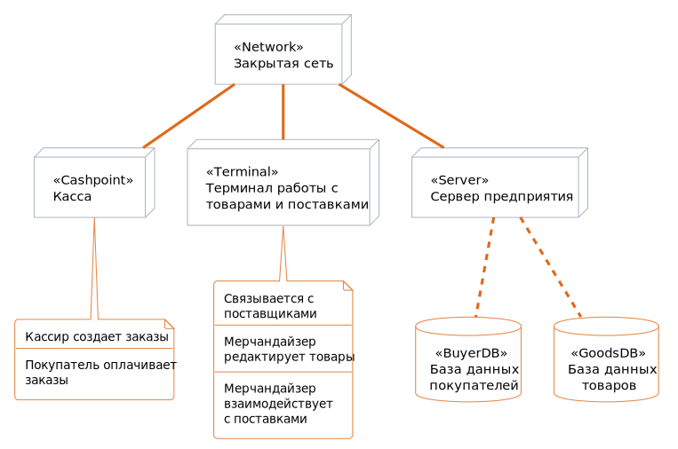
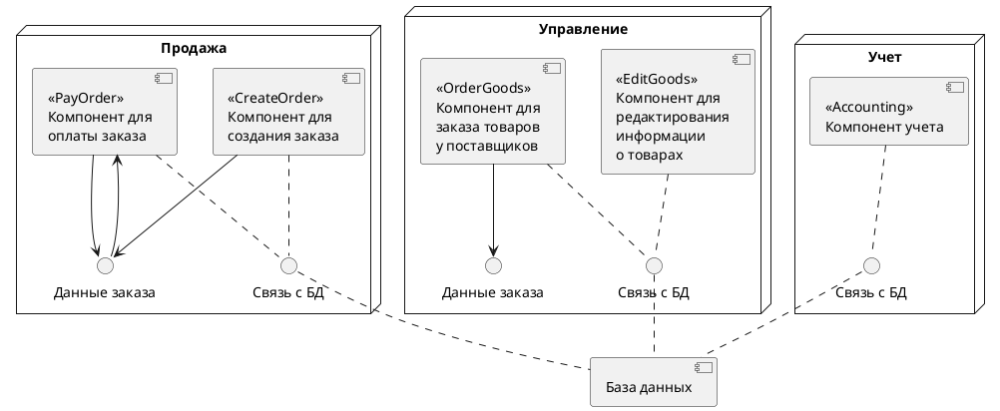
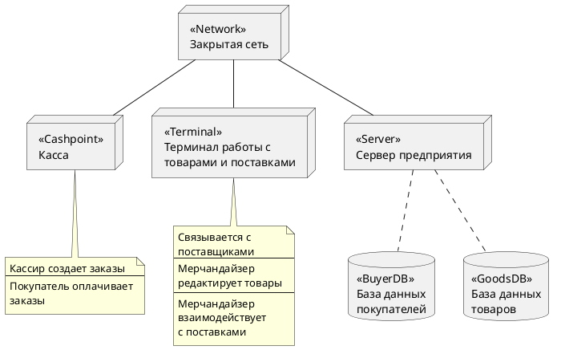

МИНИСТЕРСТВО НАУКИ И ВЫСШЕГО ОБРАЗОВАНИЯ РОССИЙСКОЙ ФЕДЕРАЦИИ 
Федеральное государственное бюджетное образовательное учреждение высшего образования 
<b>"МИРЭА - Российский технологический университет"</b>  
<b>РТУ МИРЭА</b>

---
Институт информационных технологий 
Кафедра практической и прикладной информатики

<b>ОТЧЕТ ПО ПРАКТИЧЕСКОЙ РАБОТЕ № 7</b>
  
<b>по дисциплине</b> 
«Анализ и концептуальное моделирование систем»
  

Выполнил студент группы ИКБО-02-20
&nbsp;&nbsp;&nbsp;&nbsp;&nbsp;&nbsp;&nbsp;&nbsp;&nbsp;&nbsp;&nbsp;&nbsp;
Антонов А.Д.

Принял cтарший преподаватель
&nbsp;&nbsp;&nbsp;&nbsp;&nbsp;&nbsp;&nbsp;&nbsp;&nbsp;&nbsp;&nbsp;&nbsp;&nbsp;&nbsp;&nbsp;&nbsp;&nbsp;&nbsp;&nbsp;&nbsp;&nbsp;&nbsp;
Ахмедова Х.Г.

 

Практическая работа выполнена
&nbsp;&nbsp;&nbsp;&nbsp;&nbsp;&nbsp;&nbsp;&nbsp;&nbsp;&nbsp;&nbsp;&nbsp;&nbsp;
«__» _______ 2022 г.

«Зачтено»
&nbsp;&nbsp;&nbsp;&nbsp;&nbsp;&nbsp;&nbsp;&nbsp;&nbsp;&nbsp;&nbsp;&nbsp;&nbsp;&nbsp;&nbsp;&nbsp;&nbsp;&nbsp;&nbsp;&nbsp;&nbsp;&nbsp;&nbsp;&nbsp;&nbsp;&nbsp;&nbsp;&nbsp;&nbsp;&nbsp;&nbsp;&nbsp;&nbsp;&nbsp;&nbsp;&nbsp;&nbsp;&nbsp;&nbsp;&nbsp;&nbsp;&nbsp;&nbsp;&nbsp;&nbsp;&nbsp;&nbsp;&nbsp;&nbsp;&nbsp;&nbsp;
«__» _______ 2022 г.

 Москва 2022

---

# Практическая работа №7.
**Построение UML – модели системы. Диаграммы компонентов, развертывания.**

Содержание:
- [Практическая работа №7.](#практическая-работа-7)
  - [Цели и задачи](#цели-и-задачи)
  - [Ход работы](#ход-работы)
  - [Вывод](#вывод)
  - [Приложение](#приложение)

## Цели и задачи

**Цель работы:**
научиться строить модель реализации.

**Задачи:**
построить модель реализации с помощью диаграмм компонентов и развертывания с рассмотрением основных элементов и правил построения.

**Вариант: 1**
– Моделирование организации розничного бизнеса.

## Ход работы
1. Построить диаграмму компонентов розничного торгового предприятия.

> Рис. 1 - Диаграмма компонентов

2. Построить диаграмму развертывания розничного торгового предприятия.

> Рис. 2 - Диаграмма развертывания

## Вывод
В результате выполнения данной практической работы было изучено построение модели реализации.

## Приложение
Диаграммы последовательности в этой работе сгенерированы с помощью кода.
Для генерации диаграммы использовался язык **PlantUML**, из написанного кода создана диаграмма в формате `.svg`.
Отчет написан в формате **Markdown** (`.md`) и экспортирован в формат `.pdf`.

Код диаграмм приведен ниже:

> Листинг 1 - Код диаграммы ..

 

> Листинг 2 - Код диаграммы ..

